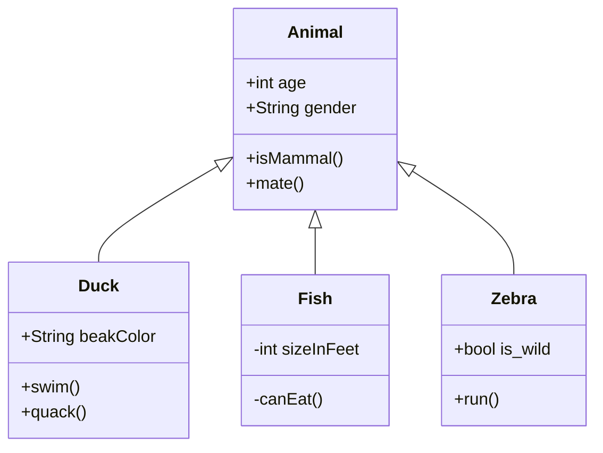
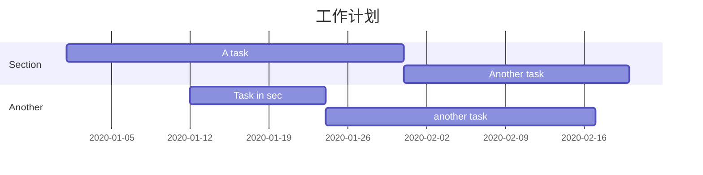
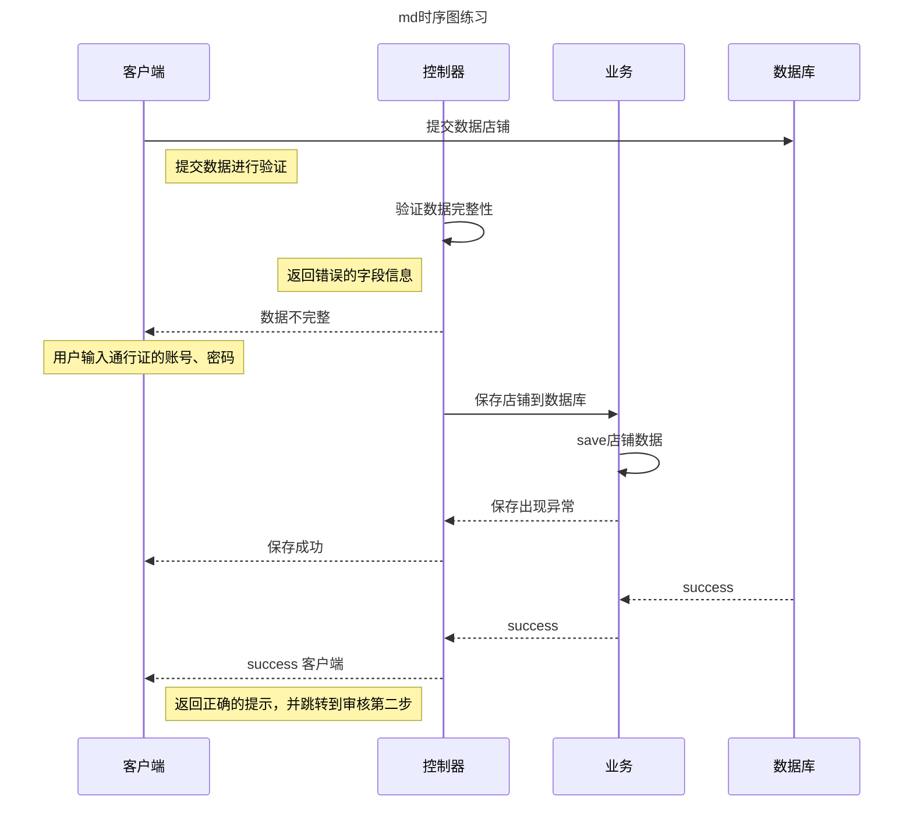

安装插件
npm install hexo-filter-mermaid-diagrams
修改配置文件
在hexo的_config.yml文件（根目录的并非主题的）中，添加以下内容：
<!-- more--> 

```# mermaid chart
mermaid: ## mermaid url https://github.com/knsv/mermaid
  enable: true  # default true
  version: "7.1.2" # default v7.1.2
  options:  # find more api options from https://github.com/knsv/mermaid/blob/master/src/mermaidAPI.js
    #startOnload: true  // default true
```
js文件修改
1. 修改位置 （next主题为例）
   
```
themes/next/layout/_partials/footer.swig
```

1. 根据footer的格式不同，添加的内容不同。
格式有after_footer.pug , after-footer.ejs ,footer.swig等。
以下是在next的footer.swig添加的内容。其他格式参考github: hexo-filter-mermaid-diagrams

```

  <script src='https://unpkg.com/mermaid@{{ theme.mermaid.version }}/dist/mermaid.min.js'></script>
  <script>
    if (window.mermaid) {
      mermaid.initialize({{ JSON.stringify(theme.mermaid.options) }});
    }
  </script>

```
到此为止，设置的部分就结束了。


1. UML类图




2. UML 甘特图




3. 时序图

    ```
   - 代表实线 ， 主动发送消息，比如 request请求
   > 代表实心箭头 ， 同步消息，比如 AJAX 的同步请求
   -- 代表虚线，表示返回消息，spring Controller return
   >> 代表非实心箭头 ，异步消息，比如AJAX请求
    ```

   




分享程序员的理财、生活！我是乐子，多多指教！


                                                    - EOF -
   